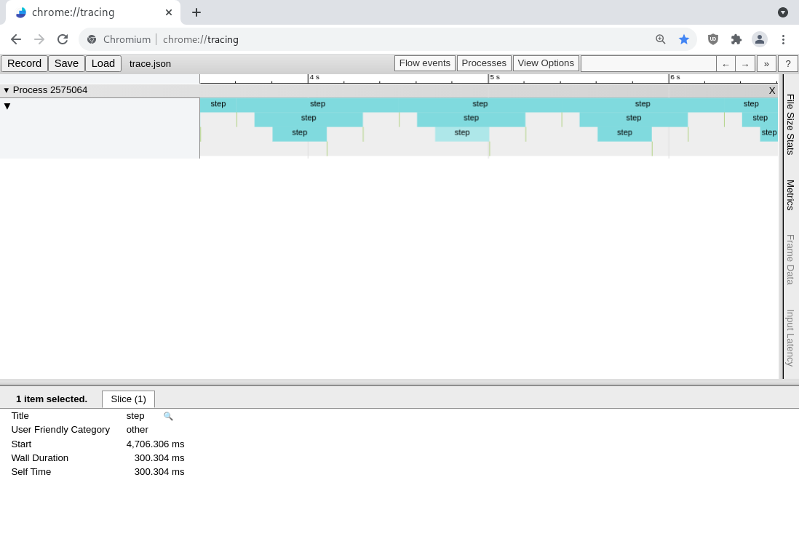
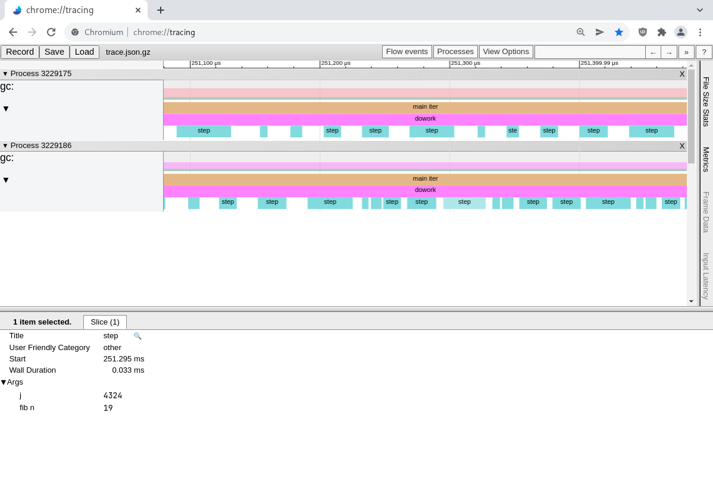

# Catapult [](https://github.com/imandra-ai/catapult/actions/workflows/main.yml)

This is a collection of tracing _backends_ for
[ocaml-trace](https://github.com/c-cube/ocaml-trace/), ultimately producing
[Catapult/TEF](https://docs.google.com/document/d/1CvAClvFfyA5R-PhYUmn5OOQtYMH4h6I0nSsKchNAySU/)
trace format.


The traces are `.json` files (or compressed `.json.gz`). They can be viewed in:
- https://ui.perfetto.dev/
- chrome://tracing in chrome/chromium
- https://github.com/wolfpld/tracy after conversion (the `tracy-import-chrome` binary)

## Usage

Instrument your code using [ocaml-trace](https://github.com/c-cube/ocaml-trace/).
In the program's entry point, use one of the Catapult libraries
backend to forward events from `Trace` into the place of your choice.

An example can be found in `examples/heavy/heavy.ml`.

## sqlite

To collect data directly into a local Sqlite database, use something like:

```ocaml
let main () =̵
  …
  let@ writer = Catapult_sqlite.Writer.with_ ~file:!db ~sync:!sync () in
  Trace.setup_collector (Catapult_sqlite.trace_collector_of_writer writer);

  …
  (* do the actual work here *)
```

(assuming this is in scope:
```ocaml
let (let@) = (@@)
```
)


## network client

The library `catapult-client` provides a tracing backend that forwards all events
(messages, traces, metrics) to a network daemon. The daemon is in the
`catapult-daemon` package.

The traces can be listed and retrieved using the `catapult-conv` program that
comes with `catapult-sqlite`.

## Systemd

An example systemd service file for this daemon can
be found in `src/data/catapult-daemon.service`.

```systemd
[Unit]
Description=Catapult daemon (receives and stores profiling traces)

[Socket]
ListenStream=6981
Accept=no

[Service]
ExecStart=catapult-daemon --addr=tcp://127.0.0.1:6981
Restart=always
RestartSec=10

[Install]
WantedBy=default.target
```

## Example: "basic"

A very stupid example (in `examples/basic/basic.ml`), is:

```ocaml
let (let@) = (@@)
let spf = Printf.sprintf

let rec fake_trace depth =
  if depth>=3 then ()
  else (
    (* the probe is here *)
    let@ _sp = Trace.with_span ~__FILE__ ~__LINE__ "step" in
    Thread.delay 0.1;
    Printf.printf "fake (depth=%d)\n%!" depth;
    fake_trace (depth+1);
    Thread.delay 0.2;
    Trace.message "iteration.done" ~data:(fun () -> ["depth", `Int depth]);
  )

let () =
  (* address of daemon *)
  let addr = Catapult_client.addr_of_string_exn "tcp://localhost:1234" in
  let@() = Catapult_client.with_ ~addr () in
  let n = try int_of_string (Sys.getenv "N") with _ -> 10 in
  Printf.printf "run %d iterations\n%!" n;

  for _i = 1 to n do
    fake_trace 0;
  done
```

Once opened in chrome://tracing, the trace looks like this:


## Example: "heavy"

A more heavy example (used to benchmark a bit the tracing), is in `examples/heavy`.

In a terminal, run the daemon (if it's not already running):

``` 
$ ./daemon.sh
```

Then in another terminal:

```
$ ./heavy.sh -n=1 --mode=net -j 2 --trace-id=mytrace
use net client tcp://127.0.0.1:6981
run 1 iterations
iteration 1
use net client tcp://127.0.0.1:6981
run 1 iterations
iteration 1

# list traces
$ catapult-conv -l
[…]
mytrace.db

# convert last trace into a file (trace.json.gz)
$ catapult-conv mytrace.db

$ ls -lh trace.json.gz 
-rw-r--r-- 1 simon simon 374K Feb 16 11:38 trace.json.gz
```

Opened in chrome, the trace looks like that (focusing on a "step" event):


## Coverage

- [x] duration events
- [x] async events
- [x] flow events
- [x] instants
- [x] metadata
- [x] counters
- [x] object events
- [ ] contexts
- [ ] memory dumps
- [ ] mark events
- [ ] clock synchro

## License

MIT
